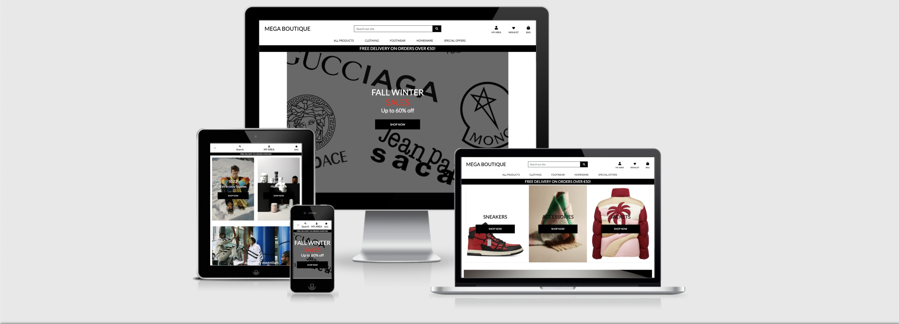
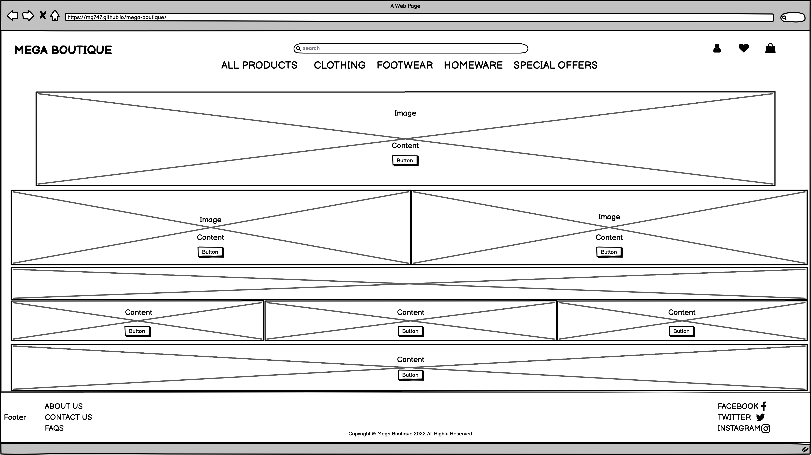
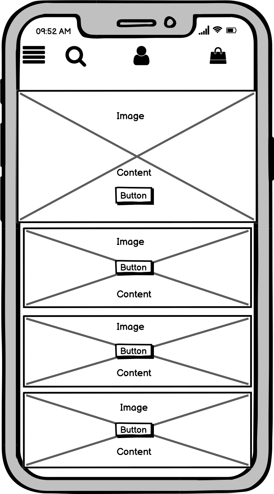

<h1 align="center">MS-4-PROJECT</h1>

[View the live project here.](https://mega-boutique.herokuapp.com/)


#### Site Name: MEGA BOUTIQUE
#### Goal : Menswears, Footwears, Accessories, Gadgets, Home and Lifestyle

## Contents
* [User Experience Design (UX)](#User-Experience-Design)
    * [User Stories](#User-Stories)
        * [First Time Visitor Goals](#First-Time-Visitor-Goals)
        * [Returning Visitor Goals](#Returning-Visitor-Goals)
        * [Frequent User Goals](#Frequent-User-Goals)

    * [Design](#Design)
        * [Colour Scheme](#Colour-Scheme)
        * [Typography](#Typography)
        * [Imagery](#Imagery)        
   
    * [Wireframes](#Wireframes)
        
* [Features](#Features)
* [Technologies Used](#Technologies-Used)
* [Languages Used](#Languages-Used)
* [Frameworks Libraries & Programs Used](Frameworks-Libraries-&-Programs-Used)

* [Testing](#Testing)
* [Testing User Stories from User Experience (UX) Section](Testing-User-Stories-from-User-Experience-(UX)-Section)
* [Further Testing](Further-Testing)
* [Known Bugs](Known-Bugs)
    
* [Deployment](#Deployment)
    * [GitHub Pages](#Deployment-To-Heroku)
    * [Forking the GitHub Repository](#Forking-the-GitHub-Repository)
    * [Making a Local Clone](#Making-a-Local-Clone)

* [Credits](#Credits)
    * [Code](#Code)
* [Content](#Content)
* [Media](#Media)
* [Acknowledgements](#Acknowledgements)

## User Experience (UX)

-   ### User stories

    -   #### First Time Visitor Goals

        1. As a Shopper, I want to be able to view a list of products, so that I can select some to purchase.
        2. As a Shopper, I want to be able to view individual product details so that I can identify. The product Image, the price, the product description and the available sizes.
        3. As a Shopper, I want to look for testimonials to understand what other users think of the site and the service it renders. 
        4. As a First Time Visitor, I want to sign up to the site to enable me full access to it's service and also to recieve email newsletter and latest updates. 

    -   #### Returning Visitor Goals

        1. As a Returning Visitor, I want to see new products and deals.
        2. As a Returning Visitor, I want to find the best way to get in contact with the site owner with any questions I may have.
        3. As a Frequent User, I want to be able to login to the site view my profile and add items to wishlist. 

    -   #### Frequent User Goals
        1. As a Frequent User, I want to browse the site to see if there are any changes, news and/or updates.
        2. As a Frequent User, I want to see information about the most new arrivals and sales.

-   ### Design
    -   #### Colour Scheme
        -   The two main colours used are Code Institute black, and white.
    -   #### Typography
        -   The Lato font is the main font used throughout the whole website. Lato is a clean font used frequently in programming, so it is both attractive and appropriate.
    -   #### Imagery
        -   Imagery is important. The Images used across the site and in cards were designed to be striking and to catch the user's attention. It also has a modern, energetic aesthetic.

*   ## Wireframes

-   #### Desktop View

#### Home Page Skeleton Plane


-   #### Mobile View
#### Home Page Skeleton Plane


## Features

-   Responsive on all device sizes

-   Interactive elements

## Technologies Used

### Languages Used

-   [HTML5](https://en.wikipedia.org/wiki/HTML5)
-   [CSS3](https://en.wikipedia.org/wiki/Cascading_Style_Sheets)
-   [Jquery](https://en.wikipedia.org/wiki/Jquery)
-   [Python3](https://en.wikipedia.org/wiki/Python_Programming_Language)

### Frameworks, Libraries & Programs Used

1. [Bootstrap 4.6.x:](https://getbootstrap.com/)
    - Bootstrap 4.6.x was used to assist with the responsiveness and styling of the website.
2. [Hover.css:](https://ianlunn.github.io/Hover/)
    - Hover.css was used on the Social Media icons in the footer to add the float transition while being hovered over.
3. [Font Awesome 5.13.1:](https://fontawesome.com/)
    - Font Awesome was used on all pages throughout the website to add icons for aesthetic and UX purposes.
4. [jQuery:](https://jquery.com/)
    - jQuery came with bootstrap to make the navbar entire site responsive.
5. [Git](https://git-scm.com/)
    - Git was used for version control by utilizing the Gitpod terminal to commit to Git and Push to GitHub.
6. [GitHub:](https://github.com/)
    - GitHub is used to store the projects code after being pushed from Git.
7. [GoogleAPI:](https://console.cloud.google.com/apis)
    - GoogleAPI was used during the design process.    
8. [Balsamiq:](https://balsamiq.com/)
    - Balsamiq was used to create the [wireframes](https://github.com/) during the design process.
9. [Heroku:](https://heroku.com/)
    - Heroko was used to create  and deploy our app.    
10. [Django:](https://django.com/)
    - Django was used to create the [framework].
11. [Postgresql:](https://postgresql.org/)
    - Mongodb was used to create database and to connect server to our site.
12. [Stripe:](https://stripe.com/)
    - Stripe was used to accept and authorise payment for any item purchased on the site.
13. [AWS:](https://s3.console.aws.amazon.com/)
    - Amazon S3 was used to manage and save media and collectstatic file in Its cloud service.        

## Testing

The W3C Markup Validator and W3C CSS Validator Services were used to validate every page of the project to ensure there were no syntax errors in the project.

-   [W3C Markup Validator](https://jigsaw.w3.org/css-validator/#validate_by_input) - [Results](https://github.com/)
-   [W3C CSS Validator](https://jigsaw.w3.org/css-validator/#validate_by_input) - [Results](https://github.com/)
-   [Lighthouse](https://https://developers.google.com/web/tools/lighthouse) - [Results](https://github.com/)

### Testing User Stories from User Experience (UX) Section

-   #### First Time Visitor Goals

    1. As a Shopper, I want to be able to view a list of products, so that I can select an item to purchase.

      1. Upon entering the site. The homepage navigation bar have links to list of products and categories, user have the option to view all products or search for a specific product. 

    2. As a Site User, I want to be able to register for an account and have a personalised user profile.

      1. The Site User can register to view their personal order history and order confirmations, and save their payment information by clicking on My Area icon on the homepage top-right as shown on the screenshot above.

    3. As a First Time Visitor, I want to locate the site social media links to see past and present post about the site service.
       
      1. The social media links is on the footer on every page of the site. 

-   #### Returning User Goals

    1. As a Returning User, I want to see information about new products.

      1. Returning user can find contents about new products on the home page or click on New Arrivals link on the navbar.  
    
    2. As a Returning Visitor, I want to find the best way to get in contact with customer service with any questions I may have.

      1. Returning Visitor can contact customer service through contact us link on the footer of the site.

-   #### Frequent User Goals

    1. As a Frequent User, I want to see updates about any change, sales, or new products on the site.

      1. Frequent User can easily find this updates and contents on the home page. 

    2. As a Frequent User, I want to check to see if there are any new blog posts.

      1. The social media links is on the footer with links to the site blog and social post.

### Further Testing

-   The Website was tested on Google Chrome, Mozilla Firefox, Microsoft Edge and Safari browsers.
-   The website was viewed on a variety of devices such as Desktop, Laptop, iPhone SE, iPhone 11, One+ 9 Pro, and iPadPro.
-   A large amount of testing was done to ensure that all pages were linking correctly
-   Friends and family members were asked to review the site and documentation to point out any bugs and/or user experience issues.

### Known Bugs

-   There is no known bug. I will continue to debug and check to ensure that the site is working efficiently.

### Known Issues

- The About us link, Contact link, Faqs link, and Wishlist is not active and rendering yet because I didn't have enough time to finish it as I'm overdue to submit the project. I intend to further commit to this project and  fix these issues and to also add other features and functionalities for a better user experience as soon as I gain access back to my workspace.

## Deployment

### GitHub Pages

The project was deployed to GitHub Pages using the following steps...

1. Log in to GitHub and locate the [GitHub Repository](https://github.com/)
2. At the top of the Repository (not top of page), locate the "Settings" Button on the menu.
    - Alternatively Click [Here](https://raw.githubusercontent.com/) for a GIF demonstrating the process starting from Step 2.
3. Scroll down the Settings page until you locate the "GitHub Pages" Section then click to open Github pages tab.
4. Under "Source", click the dropdown called "None" and select "Main".
5. The page will automatically refresh.
6. Scroll back down through the page to locate the now published site [link](https://mg747.github.io/mega-boutique/) in the "GitHub Pages" section.

### Forking the GitHub Repository

By forking the GitHub Repository we make a copy of the original repository on our GitHub account to view and/or make changes without affecting the original repository by using the following steps...

1. Log in to GitHub and locate the [GitHub Repository](https://mg747.github.io/mega-boutique/)
2. At the top of the Repository (not top of page) just above the "Settings" Button on the menu, locate the "Fork" Button.
3. You should now have a copy of the original repository in your GitHub account.

### Making a Local Clone

1. Log in to GitHub and locate the [GitHub Repository](https://mg747.github.io/mega-boutique/)
2. Under the repository name, click "Clone or download".
3. To clone the repository using HTTPS, under "Clone with HTTPS", copy the link.
4. Open Git Bash
5. Change the current working directory to the location where you want the cloned directory to be made.
6. Type `git clone`, and then paste the URL you copied in Step 3.

```
$ git clone https://github.com/YOUR-USERNAME/YOUR-REPOSITORY
```

7. Press Enter. Your local clone will be created.

```
$ git clone https://github.com/YOUR-USERNAME/YOUR-REPOSITORY
> Cloning into `CI-Clone`...
> remote: Counting objects: 10, done.
> remote: Compressing objects: 100% (8/8), done.
> remove: Total 10 (delta 1), reused 10 (delta 1)
> Unpacking objects: 100% (10/10), done.
```

Click [Here](https://help.github.com/en/github/creating-cloning-and-archiving-repositories/cloning-a-repository#cloning-a-repository-to-github-desktop) to retrieve pictures for some of the buttons and more detailed explanations of the above process.

## Credits

### Code

-   Codes were copied and modified from the Full Stack Frameworks with Django, Boutique Ado Project.

-   Bootstrap4 template was used throughout the project mainly to make site responsive using the [bootsrap 4.6.x](https://getbootstrap.com/)

### Content

-   All content was written by the developer.

### Media

-   All Images belongs to the copyright owner or the website mentioned in code comments.

### Acknowledgements

-   My Mentor Dick Vlaanderen and Gerard Mcbride of Code Institute for their helpful guidiance and comments.  

-   Student Care and Tutor at Code Institute for their support.

### Author

-   Morgan Ugiagbe